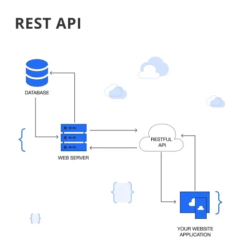
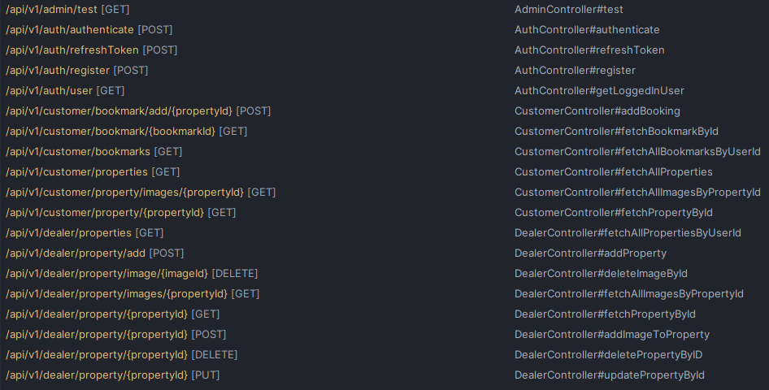
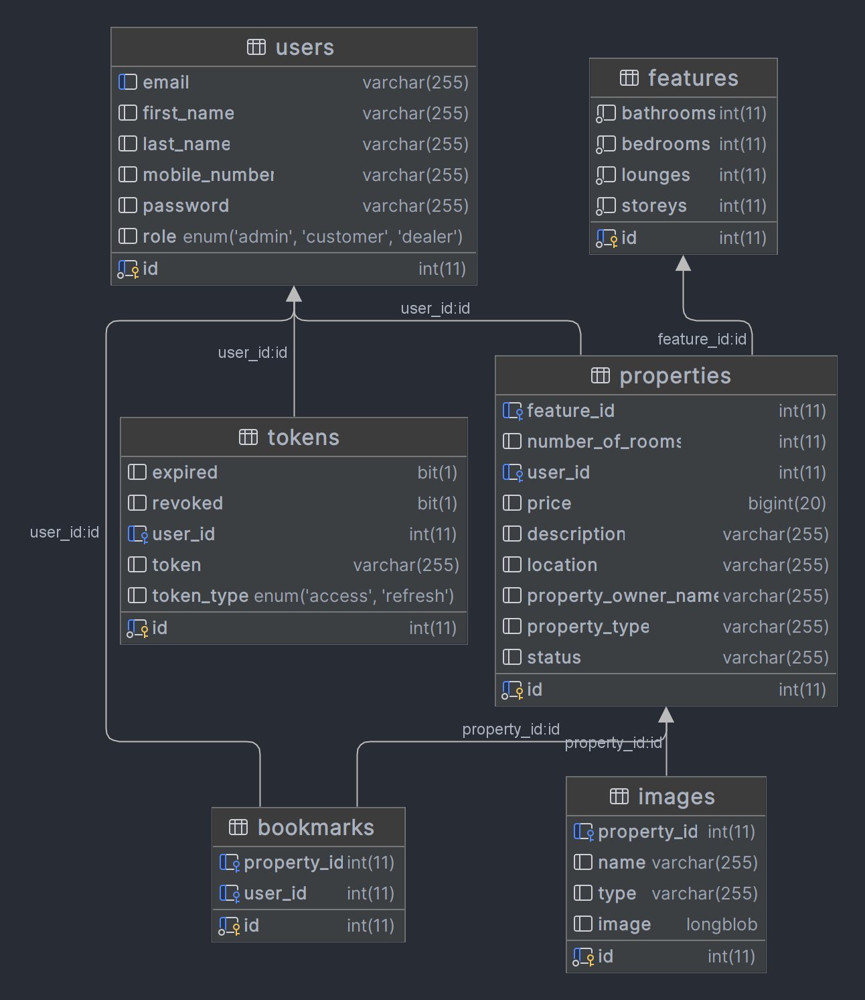
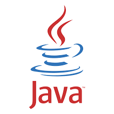
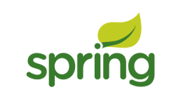

<a name="readme-top"></a>

<!-- PROJECT LOGO -->
<br />
<div align="center">
  <a href="https://github.com/kudzaiprichard/realestate-backend">
    
  </a>

  <h3 align="center">Real Estate Backend</h3>

  <p align="center">
    A real estate restful api backend 
    <br />
  </p>
  <br/>
</div>

<!-- TABLE OF CONTENTS -->
<details>
  <summary>Table of Contents</summary>
  <ol>
    <li>
      <a href="#about-the-project">About The Project</a>
      <ul>
        <li><a href="#project-scope">Project Scope</a></li>
        <li><a href="#project-design">Project Design</a></li>
        <li><a href="#built-with">Built With</a></li>
      </ul>
    </li>
    <li>
      <a href="#getting-started">Getting Started</a>
      <ul>
        <li><a href="#prerequisites">Prerequisites</a></li>
        <li><a href="#installation">Installation</a></li>
        <li><a href="#contributing">Contributing</a></li>
      </ul>
    </li>
    <li><a href="#license">License</a></li>
    <li><a href="#contact">Contact</a></li>
    <li><a href="#acknowledgments">Acknowledgments</a></li>
  </ol>
</details>

<!-- ABOUT THE PROJECT -->
# About The Project

### Project Scope

The real estate marketplace works as a mediator between homeowners and buyers/renters. Property owners can list their estate on the site,
set the approximate price, and find the customers. Customers, on the other hand, can search for a place, check property photos, building plans, and overall descriptions.

* Real estate agents can create accounts and advertise and sell there property
* Customer can view listed estates and can filter through this list of estate
* Customer must then be able to contact estate agent through that particular advert

## Project Design

### Architecture
System uses REST API Architecture. REST stands for Representational State Transfer Application Programming Interface, is a popular architectural 
style for designing networked applications. It allows different software systems to communicate with each other by 
exchanging data over the internet, typically using the HTTP protocol.



This will architecture is scalable, flexible and lightweight and allows for other third party software, mobile, web written
in different languages to easily integrate with our services

### Endpoit Design
Below is a screenshot of the project restful api endpoints and the HTTP Method supported by each endpoint



### UML Diagram
Below is the UML design of the system including relationships between the difference objects that make up the system



### Built With
Used Java spring boot , MySQL and Jason Web Token to build the rest api, including postman for testing.

<div align="center">
 
     
    
    
</div>

<p align="right">(<a href="#readme-top">back to top</a>)</p>

<!-- GETTING STARTED -->
## Getting Started

### Prerequisites

You should have the below softawares installed in your pc :
* JDK 21 and JRE
* MySQL
* and your preferred IDE or text editor

  

### Installation

1. Get a free API Key at [https://github.com/settings/tokens](https://github.com/settings/tokens)
2. Clone the repo

   ```sh
   git clone https://github.com/kudzaiprichard/spring-realestate-api
   ```

3. Open project in IDE or text editor
4. let maven download all necessary dependency for the project to run


<p align="right">(<a href="#readme-top">back to top</a>)</p>


<!--CONTRIBUTING-->
## Contributing

If you have a suggestion that would make this better, please fork the repo and create a pull request. You can also simply open an issue with the tag "enhancement".
Don't forget to give the project a star! Thanks again!

1. Fork the Project
2. Create your Feature Branch (`git checkout -b feature/AmazingFeature`)
3. Commit your Changes (`git commit -m 'Add some AmazingFeature'`)
4. Push to the Branch (`git push origin feature/AmazingFeature`)
5. Open a Pull Request

### :fire: Contribution

 Your contributions are always welcome and appreciated. Following are the things you can do to contribute to this project.

 1. **Report a bug** <br>
 If you think you have encountered a bug, and I should know about it, feel free to report it [here]() and I will take care of it.

 2. **Request a feature** <br>
 You can also request for a feature [here](), and if it will viable, it will be picked for development.  

 3. **Create a pull request** <br>
 It can't get better than this, your pull request will be appreciated by the community. You can get started by picking up any open issues from [here]() and make a pull request.

 > If you are new to open-source, make sure to check read more about it [here](https://www.digitalocean.com/community/tutorial_series/an-introduction-to-open-source) and learn more about creating a pull request [here](https://www.digitalocean.com/community/tutorials/how-to-create-a-pull-request-on-github).

<p align="right">(<a href="#readme-top">back to top</a>)</p>


<!-- LICENSE -->
## License

Distributed under the MIT License. See `LICENSE.txt` for more information.

<p align="right">(<a href="#readme-top">back to top</a>)</p>


<!-- CONTACT -->
## Contact

Kudzai P Matizirofa - [linkedin.com/in/kudzai-prichard](www.linkedin.com/in/kudzai-prichard) - <kudzaiprichard@gmail.com>

Project Link: [https://github.com/kudzaiprichard/spring-realestate-api](https://github.com/kudzaiprichard/spring-realestate-api)

<p align="right">(<a href="#readme-top">back to top</a>)</p>

<!-- ACKNOWLEDGMENTS -->
## Acknowledgments

list of resources I found helpful and would like to give credit to.

* [Choose an Open Source License](https://choosealicense.com)
* [Restful Api Explained](https://aws.amazon.com/what-is/restful-api/)
* [Jason Web Tokens](https://jwt.io/)
* [Spring Boot docs](https://docs.spring.io/spring-boot/docs/current/reference/htmlsingle/)
* [GitHub Pages](https://pages.github.com) 
* [MySql docs](https://dev.mysql.com/doc/)

<p align="right">(<a href="#readme-top">back to top</a>)</p>

